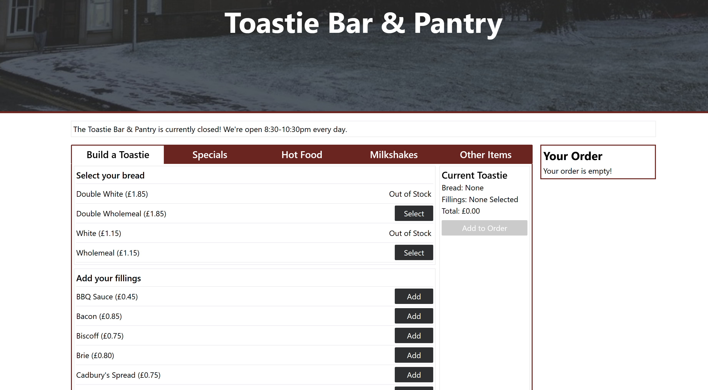

# A Developer’s Guide: Balancing Real-World Requirements While Learning React

## 🚀 Motivation – Building Under Real Constraints

When I took on the Grey College JCR website role, it felt like more than just a side project. It was a chance to give back to a community I was actively part of. The site wasn’t just a webpage — it was how events were promoted, how students ordered food, found committee information, and engaged with the college beyond lectures and socials. I wanted to improve that experience for everyone.

At the same time, I saw this as an opportunity to live out the reality of a software developer—solving problems under constraints, managing incoming requests from different people, and keeping a live product working. It wasn’t a simulation. There were real users, real deadlines, and real expectations. If something broke, people noticed. That responsibility pushed me to think more clearly, test more thoroughly, and communicate more effectively.

Unlike coursework, there were no pre-defined specs. I had to ask the right questions, translate non-technical goals into solutions, and deal with issues I didn’t anticipate. I wasn’t just writing code - I was maintaining a service.

The goal wasn’t to learn React - it was to deliver features. But React became the best tool for the job.

---

## 🧠 Background – What You Should Know

This guide is for students who want to build practical experience—not just by following tutorials, but by taking ownership of a live project.

Before starting, I was familiar with:
- HTML/CSS basics
- JavaScript (ES6+)
- Git version control
- Command line usage 
- Writing basic scripts

But I hadn’t used React, Express, or WSL for real work. I learned all three by doing.

📘 Catch-Up Materials:
- [MDN HTML & CSS](https://developer.mozilla.org/en-US/docs/Web)
- [JavaScript.info](https://javascript.info/)
- [Git Handbook](https://guides.github.com/introduction/git-handbook/)
- [React Docs](https://react.dev/learn)
- [Vite Setup](https://vitejs.dev/guide/)

---

## ⚒️ Learning Materials – What Helped Me Most

### 1. 🧠 React Docs
[https://react.dev/learn](https://react.dev/learn)  
The official documentation was my main resource. I focused on:
- JSX and components
- `useState` and `useEffect`
- Props and conditional rendering

### 2. ⚡ Vite for React Setup
[https://vitejs.dev/](https://vitejs.dev/)  
Vite is much faster than Create React App and worked well on my WSL system. Instant reload, easy config, and great with modern JS.

### 3. 🐧 Bash + WSL Ubuntu
I worked inside Ubuntu on Windows using WSL2. This helped me:
- Automate media uploads with `lftp`
- Use `deploy.sh` scripts to sync updated content via SFTP
- Run local development servers in a Linux environment

### 4. 🧪 Postman
[https://www.postman.com/](https://www.postman.com/)  
Used for testing backend endpoints before connecting them to the frontend. Helpful for debugging POST requests and JSON responses.

### 5. 📘 Markdown Guide
[https://www.markdownguide.org/](https://www.markdownguide.org/)  
I wrote all documentation and guides in Markdown. It’s clean, readable, and renders well on GitHub.

### 6. 🧑‍💻 Older Computer Scientists
I was initially mentored by a third year computer scientist who was in the role before me, who was incredibly helpful when I got stuck. 
I'd recommend reaching out to older students - they often know how to explain things in a way students can understand (because they've been there too!)

---

## 🔍 Evaluation – How Useful Was It?

### React
React wasn’t part of the original plan—it was something I learned out of necessity. Once the JCR President asked for features like a toastie order form and pool rankings, I needed something dynamic. React let me:
- Reuse layout components like headers and footers
- Build form inputs that update state in real time
- Handle user submissions and show confirmation messages

It wasn’t easy at first. Hooks and JSX felt foreign. But by applying it to real features, I learned faster than I ever did through tutorials.

### Working in WSL
Using WSL made me feel like a real developer. It simulated a production environment and let me script deployments. It wasn’t always smooth — permissions and file paths were tricky — but I learned to troubleshoot with the help of Gemini and ChatGPT. Using AI powered debugging made the whole process much faster, and I'd highly recommend it.

### Bash and SFTP
Every image or content update used to be done manually. I automated it using `lftp` and a short Bash script:
```bash
lftp -e "mirror -R ./site /public_html && quit" -u user,pass sftp://hostname
```
This reduced errors and saved loads of time.

### Competing Requirements
My biggest lesson was managing multiple demands:
- The committee wanted things done quickly.
- I wanted time to learn and build properly.
- Users needed it to be intuitive and reliable.

I learned to communicate clearly, deliver in small pieces, and be honest when something would take time.

---

## 📋 Presentation – Developer Best Practices

### ✅ Git Usage
- Branch for each feature (`git checkout -b feat-toastie-form`)
- Commit often with messages like `fix: form validation bug`
- Push to GitHub and open a pull request (even if just for myself)

### 🗂️ Project Structure


### 🧾 Documentation
Everything I did was documented:
- `README.md` – what the site does and how to run it
- `setup.md` – how to get it working on WSL
- `deploy.md` – how to sync changes to the live site
- `changelog.md` – record of what changed and when

### 🧠 Collaboration
The JCR President wasn’t a developer. I had to translate technical choices into decisions he could understand:
- “Should this page be editable by exec members?”
- “Would you prefer dropdowns or free text boxes?”
- “Do we want this live now or wait until it’s mobile-friendly?”

It helped me practice communication and prioritisation: two key skills for any developer.

---

## 📦 Feature Spotlight – Toastie Ordering System

One of the more fun features was the online toastie order system. Students could pick their fillings, confirm their order, and send it directly to the kitchen queue.

### Technologies used:
- React form with `useState` to track choices
- Simple backend endpoint to log orders
- Toast confirmation messages after submission

### UI Flow:
```
<ToastieForm />
 ┣ Dropdown menus for cheese/meat/extras
 ┣ Submit button sends order
 ┗ Confirmation message rendered with state
```

### Screenshot:



It felt like a small project but taught me:
- How to manage form state
- Validate user input
- Give feedback on success/failure

---

## ✅ Final Thoughts

Working as a student developer on a real site taught me more than any course project. I learned to:
- Ship code under pressure
- Communicate across disciplines
- Debug Bash, React, and APIs in the same afternoon

It also showed me how valuable clear documentation, automation, and feedback loops are. Those things don’t just make you a better developer—they make the project easier to maintain and hand over.

The key isn’t knowing everything. It’s being resourceful, curious, and focused on solving the right problem.

You don’t need to become a React expert to do real work. You just need to keep things running, learn as you go, and leave the project in a better state than you found it.
